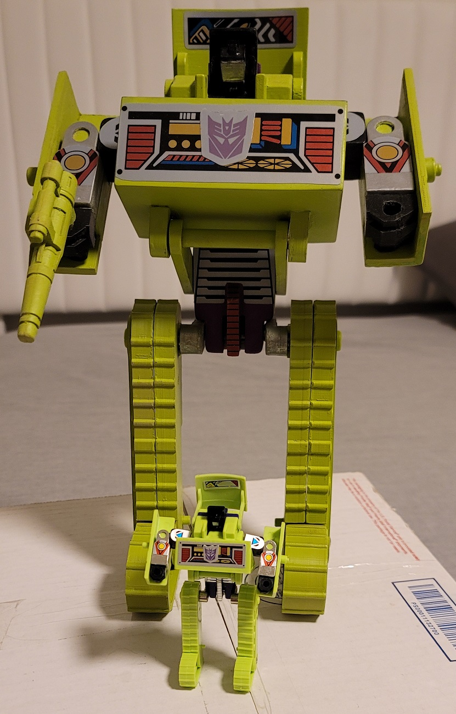
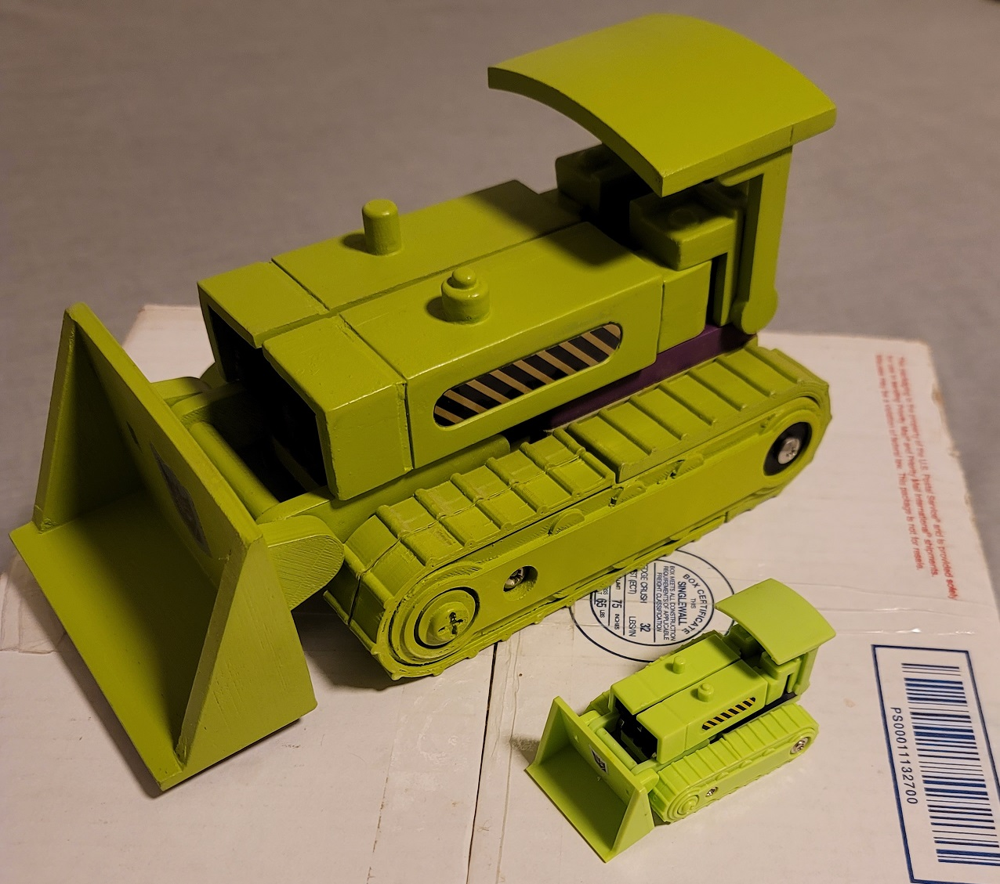
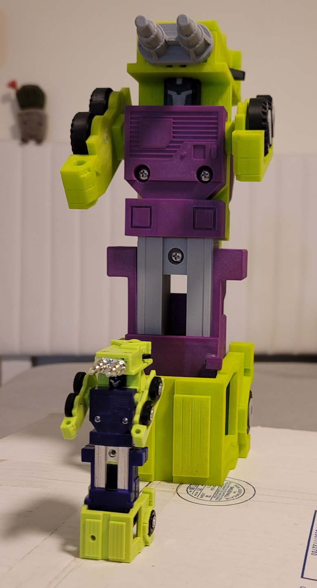
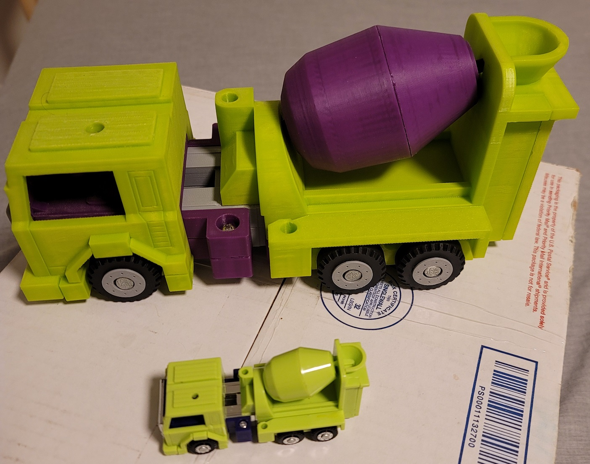
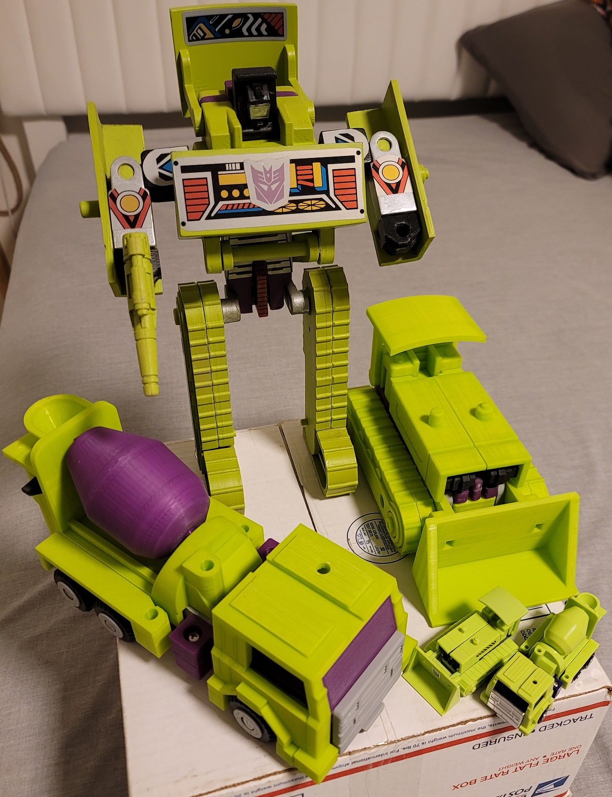

# G1_Devastator_CAD

CAD Recreation of Transformers G1 Devastator Toys for 3D Printing

This is just something I'm doing for fun. Maybe I'll finish it, maybe I won't...
The goal is to print a 300% scale G1 devastator. 2 printed so far. Lookin' cool!
I'll fix this up later.  

I will also add assembly instructions and where to make the springs and pins.  
I will also add 300% scale STL files for printing.  
300% scaled sticker sheets wiull also be included.  

Here is what is done so far:  
Boncrusher done  
Mixmaster done  

Bonecrusher's weapon done  
Mixmaster's dual head missile done  

