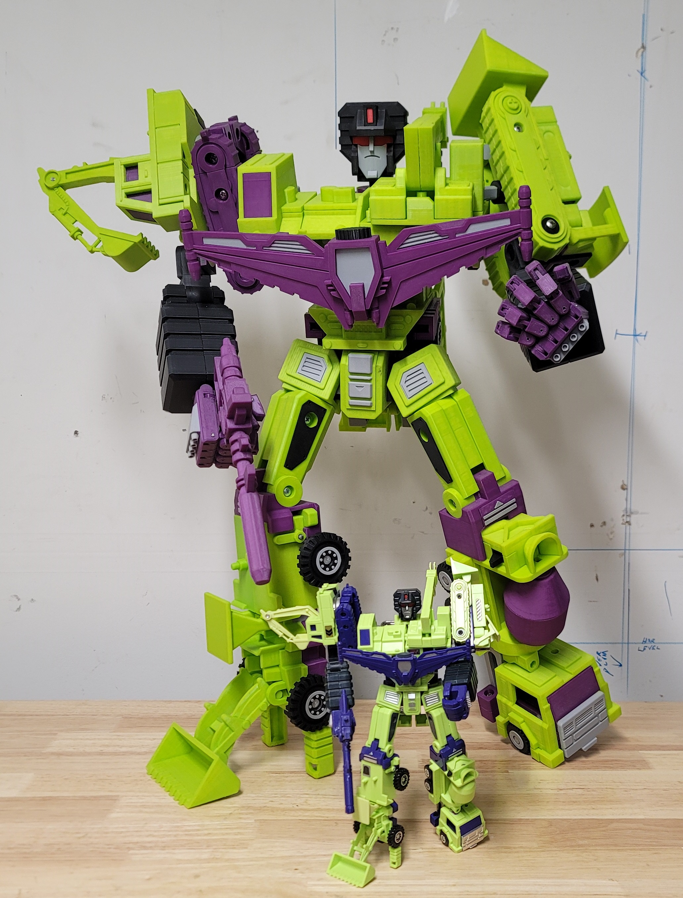
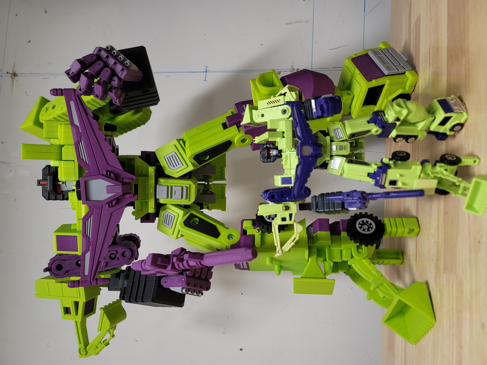
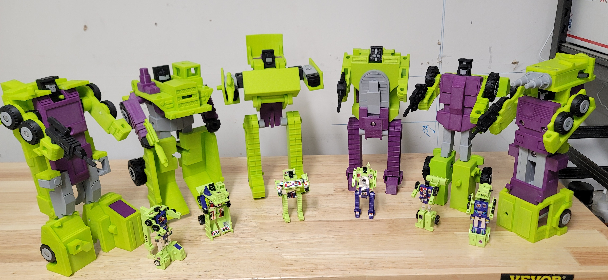
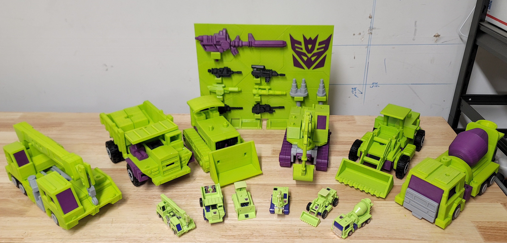
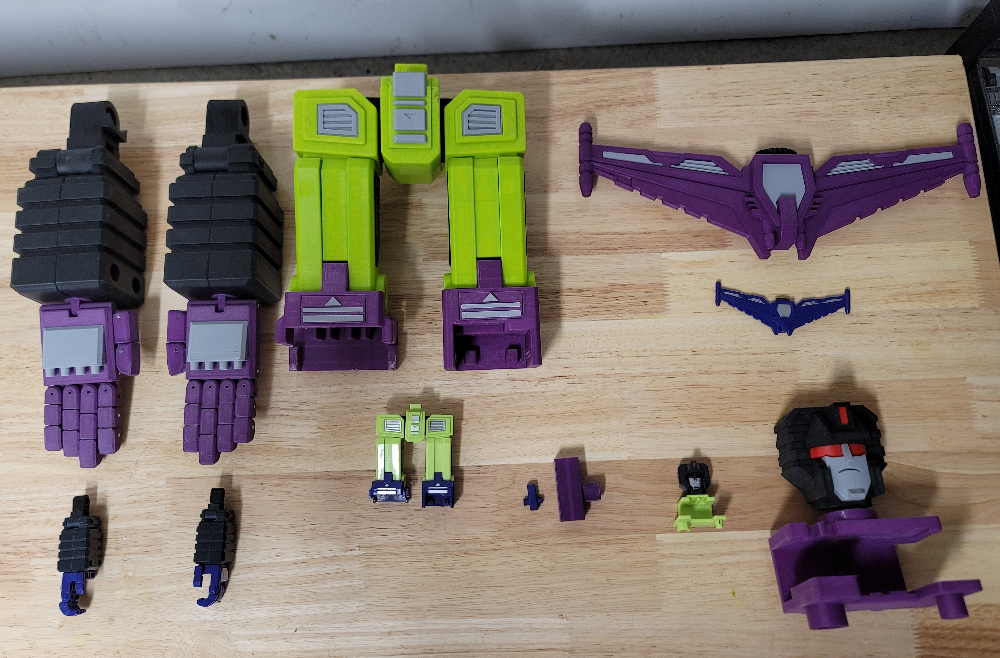

# G1_Devastator_CAD

CAD Recreation of Transformers G1 Devastator Toys for 3D Printing

This is just something I'm doing for fun. Maybe I'll finish it, maybe I won't...
The goal is to print a 300% scale G1 devastator. Devastator built!

I need to go through all the models and make minor fixes to make the joints more sturdy.

I will also add assembly instructions and where to make the springs and pins.  
I will also add 300% scale STL files for printing.  
300% scaled sticker sheets wiull also be included.  

Here is what is done so far:  
All 6 constructicons done
JB-07 upgrade kit done
All weapons done

Things left to do:
All stickers
G1 Devastator combiner parts.

